# Distributed Voting Application

A sample distributed microservices application designed for DevOps learning, following the Twelve-Factor App principles.

## 🏗️ Architecture

This application consists of three microservices:

```mermaid
graph TB
    subgraph "External"
        User[👤 User]
        Browser[🌐 Browser]
    end
    
    subgraph "Load Balancer / Reverse Proxy"
        LB[🔀 Load Balancer]
    end
    
    subgraph "Microservices"
        Vote[🗳️ Vote Service<br/>Python Flask<br/>Port: 5000]
        Worker[⚙️ Worker Service<br/>Go<br/>Port: 8080]
        Result[📊 Result Service<br/>Node.js + Socket.IO<br/>Port: 3000]
    end
    
    subgraph "Data Layer"
        Redis[(🔴 Redis<br/>Message Queue<br/>Port: 6379)]
        MySQL[(🐬 MySQL<br/>Database<br/>Port: 3306)]
    end
    
    subgraph "Monitoring"
        Prometheus[📈 Prometheus<br/>Metrics Collection<br/>Port: 9090]
    end
    
    %% User interactions
    User --> Browser
    Browser --> LB
    LB --> Vote
    LB --> Result
    
    %% Service interactions
    Vote --> Redis
    Worker --> Redis
    Worker --> MySQL
    Result --> MySQL
    
    %% Real-time communication
    Result -.->|WebSocket| Browser
    
    %% Health checks
    Vote -.->|Health Check| Redis
    Worker -.->|Health Check| Redis
    Worker -.->|Health Check| MySQL
    Result -.->|Health Check| MySQL
    
    %% Metrics collection
    Vote -.->|/metrics| Prometheus
    Worker -.->|/metrics| Prometheus
    Result -.->|/metrics| Prometheus
    
    %% Data flow
    Redis -->|Poll votes| Worker
    MySQL -->|Query results| Result
    
    classDef service fill:#e1f5fe,stroke:#01579b,stroke-width:2px
    classDef data fill:#f3e5f5,stroke:#4a148c,stroke-width:2px
    classDef user fill:#e8f5e8,stroke:#1b5e20,stroke-width:2px
    classDef monitoring fill:#fff3e0,stroke:#e65100,stroke-width:2px
    
    class Vote,Worker,Result service
    class Redis,MySQL data
    class User,Browser user
    class Prometheus monitoring
```



### Data Flow

1. **Vote Submission**: User votes through the web interface → Vote service stores vote in Redis queue
2. **Vote Processing**: Worker service polls Redis → Processes votes → Stores in MySQL database
3. **Result Display**: Result service queries MySQL → Real-time updates via WebSocket to browser
4. **Monitoring**: All services expose metrics → Prometheus scrapes metrics for monitoring

### 🗳️ Vote Service (Python Flask)
- **Purpose**: Front-end web application for voting
- **Technology**: Python Flask
- **Features**: 
  - Web interface for voting between cats and dogs
  - Stores votes in Redis queue
  - Health check endpoint
  - Prometheus metrics
  - Structured logging

### ⚙️ Worker Service (Go)
- **Purpose**: Background worker that processes votes
- **Technology**: Go
- **Features**:
  - Consumes votes from Redis queue
  - Stores votes in MySQL database
  - Health check endpoint
  - Prometheus metrics
  - Graceful shutdown

### 📊 Result Service (Node.js)
- **Purpose**: Real-time results display
- **Technology**: Node.js with Socket.IO
- **Features**:
  - Real-time vote results
  - WebSocket updates
  - Health check endpoint
  - Prometheus metrics
  - Modern responsive UI

## 🏃‍♂️ Getting Started

### Prerequisites
- Docker
- Docker Compose
- Basic knowledge of containerization
- (Optional) [Just](https://github.com/casey/just) or Make for build automation

### Student Exercise: Containerization

This is a hands-on DevOps learning project. Students need to create the Docker configuration files:

1. **Create Dockerfiles** for each service:
   - `vote/Dockerfile` - Python Flask application
   - `worker/Dockerfile` - Go application  
   - `result/Dockerfile` - Node.js application

2. **Create docker-compose.yml** for orchestration:
   - Define all services (vote, worker, result, redis, mysql)
   - Configure networking and dependencies
   - Set up health checks and monitoring

3. **Create supporting files**:
   - Database initialization script
   - Prometheus configuration
   - Environment configurations

4. **Create build automation** (optional but recommended):
   - `justfile` or `Makefile` with common development tasks
   - Commands for building, starting, testing services
   - Health checks and log viewing

**Note**: Comprehensive test suites are provided for each service and ready to use in CI/CD pipelines. Students can run these tests to validate their implementations and use them as examples for testing best practices.

### Solution Files

Complete solution files are available in the `solutions/` directory for reference after attempting the exercises.

### Running the Application

Once Docker files are created:

```bash
# Build all images
docker-compose build

# Start all services
docker-compose up -d

# Check service health (if you created automation scripts)
# just health  # or make health

# View logs
docker-compose logs -f
```

### Development Mode

#### Option 1: Individual Services with Docker Dependencies

For development, you can run Redis and MySQL in Docker containers while running the services individually on your host machine:

```bash
# Start Redis and MySQL containers
docker run -d --name voting-redis -p 6379:6379 redis:7-alpine
docker run -d --name voting-mysql -p 3306:3306 \
  -e MYSQL_ROOT_PASSWORD=votingpass \
  -e MYSQL_DATABASE=voting \
  -e MYSQL_USER=voting_user \
  -e MYSQL_PASSWORD=voting_pass \
  mysql:8.0

# Wait for MySQL to be ready (about 30-60 seconds)
docker logs voting-mysql  # Check if MySQL is ready

# Install dependencies for each service
cd vote && python3 -m venv venv && source venv/bin/activate && pip3 install -r requirements.txt && cd ..
cd worker && go mod download && cd ..
cd result && npm install && cd ..
```

Now run each service in separate terminals:

```bash
# Terminal 1 - Vote Service
cd vote
source venv/bin/activate
export REDIS_HOST=localhost
export REDIS_PORT=6379
python3 app.py

# Terminal 2 - Worker Service  
cd worker
export REDIS_HOST=localhost
export REDIS_PORT=6379
export MYSQL_HOST=localhost
export MYSQL_PORT=3306
export MYSQL_USER=voting_user
export MYSQL_PASSWORD=voting_pass
export MYSQL_DATABASE=voting
go run main.go

# Terminal 3 - Result Service
cd result
export MYSQL_HOST=localhost
export MYSQL_PORT=3306
export MYSQL_USER=voting_user
export MYSQL_PASSWORD=voting_pass
export MYSQL_DATABASE=voting
npm start
```

To clean up when done:
```bash
docker stop voting-redis voting-mysql
docker rm voting-redis voting-mysql
```

#### Development Helper Scripts

You can create helper scripts to make development easier:

**start-dev-deps.sh** (Start development dependencies):
```bash
#!/bin/bash
echo "Starting Redis and MySQL for development..."
docker run -d --name voting-redis -p 6379:6379 redis:7-alpine
docker run -d --name voting-mysql -p 3306:3306 \
  -e MYSQL_ROOT_PASSWORD=votingpass \
  -e MYSQL_DATABASE=voting \
  -e MYSQL_USER=voting_user \
  -e MYSQL_PASSWORD=voting_pass \
  mysql:8.0

echo "Waiting for MySQL to be ready..."
sleep 30
echo "Development dependencies started!"
echo "Redis: localhost:6379"
echo "MySQL: localhost:3306 (user: voting_user, password: voting_pass, db: voting)"
```

**stop-dev-deps.sh** (Stop development dependencies):
```bash
#!/bin/bash
echo "Stopping development dependencies..."
docker stop voting-redis voting-mysql 2>/dev/null
docker rm voting-redis voting-mysql 2>/dev/null
echo "Development dependencies stopped and removed."
```

**dev-env.sh** (Set environment variables):
```bash
#!/bin/bash
# Source this file to set environment variables for development
export REDIS_HOST=localhost
export REDIS_PORT=6379
export MYSQL_HOST=localhost
export MYSQL_PORT=3306
export MYSQL_USER=voting_user
export MYSQL_PASSWORD=voting_pass
export MYSQL_DATABASE=voting
echo "Environment variables set for development"
```

Usage:
```bash
# Make scripts executable
chmod +x start-dev-deps.sh stop-dev-deps.sh

# Start dependencies
./start-dev-deps.sh

# Set environment variables
source dev-env.sh

# Run services (in separate terminals)
cd vote && source venv/bin/activate && python3 app.py
cd worker && go run main.go  
cd result && npm start
```

#### Option 2: All Services via Docker Compose

Run all services using Docker Compose (requires Docker files to be created):

```bash
# Build and start all services
docker-compose up -d

# View logs
docker-compose logs -f
```

#### Development Troubleshooting

**Check if dependencies are running:**
```bash
# Check Redis
docker ps | grep voting-redis
redis-cli -h localhost -p 6379 ping  # Should return PONG

# Check MySQL
docker ps | grep voting-mysql
docker exec voting-mysql mysql -u voting_user -pvoting_pass -e "SELECT 1;"
```

**View dependency logs:**
```bash
docker logs voting-redis
docker logs voting-mysql
```

**Connect to databases directly:**
```bash
# Redis CLI
redis-cli -h localhost -p 6379

# MySQL CLI
docker exec -it voting-mysql mysql -u voting_user -pvoting_pass voting
```

**Common issues:**
- **Port conflicts**: Make sure ports 3306, 5000, 6379, 8080, and 3000 are not in use
- **MySQL not ready**: Wait 30-60 seconds after starting MySQL container
- **Environment variables**: Make sure all required env vars are set
- **Dependencies**: Ensure Redis and MySQL containers are running before starting services

### Common Commands

```bash
# Stop all services
docker-compose down

# Clean up everything
docker-compose down -v --rmi all

# Check service status  
docker-compose ps

# View specific service logs
docker-compose logs vote
docker-compose logs worker
docker-compose logs result
```

## 🔧 Configuration

All services are configured using environment variables following the [Twelve-Factor App](https://12factor.net/) methodology.

### Vote Service Environment Variables
- `REDIS_HOST`: Redis hostname (default: localhost)
- `REDIS_PORT`: Redis port (default: 6379)
- `REDIS_DB`: Redis database number (default: 0)
- `REDIS_PASSWORD`: Redis password (optional)
- `VOTE_QUEUE`: Redis queue name (default: votes)
- `PORT`: Service port (default: 5000)
- `HOST`: Service host (default: 0.0.0.0)

### Worker Service Environment Variables
- `REDIS_HOST`: Redis hostname (default: localhost)
- `REDIS_PORT`: Redis port (default: 6379)
- `REDIS_DB`: Redis database number (default: 0)
- `REDIS_PASSWORD`: Redis password (optional)
- `VOTE_QUEUE`: Redis queue name (default: votes)
- `MYSQL_HOST`: MySQL hostname (default: localhost)
- `MYSQL_PORT`: MySQL port (default: 3306)
- `MYSQL_USER`: MySQL username (default: root)
- `MYSQL_PASSWORD`: MySQL password
- `MYSQL_DATABASE`: MySQL database name (default: voting)
- `PORT`: Service port (default: 8080)
- `HOST`: Service host (default: 0.0.0.0)

### Result Service Environment Variables
- `MYSQL_HOST`: MySQL hostname (default: localhost)
- `MYSQL_PORT`: MySQL port (default: 3306)
- `MYSQL_USER`: MySQL username (default: root)
- `MYSQL_PASSWORD`: MySQL password
- `MYSQL_DATABASE`: MySQL database name (default: voting)
- `PORT`: Service port (default: 3000)
- `HOST`: Service host (default: 0.0.0.0)
- `POLL_INTERVAL`: Database polling interval in ms (default: 5000)

## 🏥 Health Checks

Each service provides a health check endpoint:

- **Vote Service**: `GET /health` - Checks Redis connection
- **Worker Service**: `GET /health` - Checks Redis and MySQL connections
- **Result Service**: `GET /health` - Checks MySQL connection

### Health Check Examples

```bash
# Check vote service health
curl http://localhost:5000/health

# Check worker service health
curl http://localhost:8080/health

# Check result service health
curl http://localhost:3000/health
```

## 📊 Monitoring and Metrics

All services expose Prometheus metrics at `/metrics` endpoint:

- **Vote Service**: http://localhost:5000/metrics
- **Worker Service**: http://localhost:8080/metrics
- **Result Service**: http://localhost:3000/metrics

### Available Metrics

#### Vote Service
- `votes_total`: Total number of votes by choice
- `request_duration_seconds`: HTTP request duration
- `health_checks_total`: Health check count by status

#### Worker Service
- `votes_processed_total`: Total votes processed by choice
- `redis_errors_total`: Redis connection errors
- `database_errors_total`: Database errors
- `health_checks_total`: Health check count by status
- `vote_process_duration_seconds`: Vote processing time

#### Result Service
- `http_requests_total`: HTTP requests by method, route, and status
- `health_checks_total`: Health check count by status
- `database_queries_total`: Database queries by status
- `websocket_clients_connected`: Connected WebSocket clients

## 🗂️ Project Structure

```
voting-app/
├── vote/                   # Vote service (Python Flask)
│   ├── app.py             # Main application
│   ├── requirements.txt   # Python dependencies
│   ├── Dockerfile         # Docker configuration
│   └── templates/         # HTML templates
│       └── index.html     # Voting interface
├── worker/                # Worker service (Go)
│   ├── main.go           # Main application
│   ├── go.mod            # Go module definition
│   └── Dockerfile        # Docker configuration
├── result/               # Result service (Node.js)
│   ├── server.js         # Main application
│   ├── package.json      # Node.js dependencies
│   ├── Dockerfile        # Docker configuration
│   └── public/           # Static files
│       └── index.html    # Results interface
├── docker-compose.yml    # Multi-service orchestration
├── init.sql             # Database initialization
├── prometheus.yml       # Prometheus configuration
├── env.example          # Environment variables example
└── README.md           # This file
```

## 🛠️ Development

### Running Services Individually

#### Vote Service
```bash
cd vote
pip install -r requirements.txt
python app.py
```

#### Worker Service
```bash
cd worker
go mod download
go run main.go
```

#### Result Service
```bash
cd result
npm install
npm start
```

### Building Docker Images

```bash
# Build all images
docker-compose build

# Build specific service
docker-compose build vote
docker-compose build worker
docker-compose build result
```

## 🔍 Troubleshooting

### Common Issues

1. **Port conflicts**: Make sure ports 3000, 5000, 6379, 8080, and 3306 are available
2. **Database connection issues**: Wait for MySQL to fully initialize (can take 30-60 seconds)
3. **Redis connection issues**: Ensure Redis is running and accessible

### Viewing Logs

```bash
# View all service logs
docker-compose logs

# View specific service logs
docker-compose logs vote
docker-compose logs worker
docker-compose logs result
docker-compose logs redis
docker-compose logs mysql

# Follow logs in real-time
docker-compose logs -f
```

### Debugging

Each service includes detailed logging in JSON format. Check the logs for troubleshooting:

```bash
# Check service status
docker-compose ps

# Get into a container (requires docker-compose.yml)
docker-compose exec vote bash
docker-compose exec worker sh
docker-compose exec result sh

# Check health of all services (manual)
curl http://localhost:5000/health
curl http://localhost:8080/health
curl http://localhost:3000/health
```

## 🧪 Testing

Each service includes comprehensive test suites using Testcontainers for integration testing with real dependencies. These tests are provided for students to use in their CI/CD pipelines and quality assurance processes.

### Test Structure

**Vote Service (Python)**
- Unit tests and integration tests with Redis
- Health endpoint validation
- Vote submission and validation
- Redis queue functionality
- Error handling and edge cases

**Worker Service (Go)**
- Integration tests with Redis and MySQL
- Vote processing pipeline
- Database operations
- Error handling and retry logic
- Performance benchmarks

**Result Service (Node.js)**
- Integration tests with MySQL
- WebSocket functionality
- Real-time data updates
- API endpoint validation
- Concurrent connection handling

### Running Tests

#### Prerequisites for Testing
```bash
# Install Docker (required for Testcontainers)
docker --version

# Ensure Docker is running
docker ps
```

#### Install Test Dependencies

Each service includes its test dependencies in the standard dependency files:

```bash
# Vote Service (Python)
cd vote
python3 -m venv venv                  # Create virtual environment
source venv/bin/activate              # Activate venv (Windows: venv\Scripts\activate)
pip3 install -r requirements.txt      # Main dependencies
pip3 install -r test_requirements.txt # Test dependencies

# Worker Service (Go)
cd worker
go mod download  # Downloads all dependencies including test packages

# Result Service (Node.js)
cd result
npm install      # Installs both production and dev dependencies
```

#### Execute Tests

```bash
# Vote Service Tests (Python + pytest)
cd vote
source venv/bin/activate             # Activate virtual environment
pytest tests/ -v                    # Run all tests
pytest tests/ --cov=app             # Run with coverage
pytest tests/ -k "test_health"      # Run specific tests

# Worker Service Tests (Go + testing)
cd worker
go test ./tests -v                  # Run all tests
go test ./tests -bench=.            # Run with benchmarks
go test ./tests -cover              # Run with coverage

# Result Service Tests (Node.js + Jest)
cd result
npm test                            # Run all tests
npm run test:coverage               # Run with coverage
npm run test:watch                  # Watch mode for development
```

#### Quick Test Validation

To quickly validate that all tests are working:

```bash
# Test all services (run from project root)
cd vote && source venv/bin/activate && pytest tests/ -x && cd ..
cd worker && go test ./tests -v && cd ..
cd result && npm test && cd ..
```

### Test Features

#### Testcontainers Integration
- **Real Dependencies**: Tests run against actual Redis and MySQL containers
- **Isolation**: Each test gets fresh container instances
- **Reproducibility**: Tests run consistently across environments
- **CI/CD Ready**: Designed for automated testing pipelines

#### Test Coverage
- **Unit Tests**: Individual component testing
- **Integration Tests**: Service-to-service communication
- **API Tests**: HTTP endpoint validation
- **WebSocket Tests**: Real-time communication
- **Performance Tests**: Load and benchmark testing
- **Error Handling**: Failure scenario validation

#### Example Test Commands
```bash
# Run specific test categories
pytest tests/ -m "not slow"           # Skip slow tests
go test ./tests -short               # Short tests only
npm test -- --testPathPattern=api    # API tests only

# Debug mode
pytest tests/ -s --log-cli-level=DEBUG
go test ./tests -v -race            # Race condition detection
npm test -- --verbose               # Verbose output
```

### CI/CD Integration

The test suites are designed for easy integration into CI/CD pipelines:

#### GitHub Actions Example

```yaml
name: Test All Services

on: [push, pull_request]

jobs:
  test-vote:
    runs-on: ubuntu-latest
    steps:
      - uses: actions/checkout@v4
      - uses: actions/setup-python@v4
        with:
          python-version: '3.11'
      - name: Install dependencies
        run: |
          cd vote
          python3 -m venv venv
          source venv/bin/activate
          pip3 install -r requirements.txt
          pip3 install -r test_requirements.txt
      - name: Run tests
        run: |
          cd vote
          source venv/bin/activate
          pytest tests/ -v --cov=app

  test-worker:
    runs-on: ubuntu-latest
    steps:
      - uses: actions/checkout@v4
      - uses: actions/setup-go@v4
        with:
          go-version: '1.21'
      - name: Run tests
        run: cd worker && go test ./tests -v -cover

  test-result:
    runs-on: ubuntu-latest
    steps:
      - uses: actions/checkout@v4
      - uses: actions/setup-node@v4
        with:
          node-version: '18'
      - name: Install dependencies
        run: cd result && npm install
      - name: Run tests
        run: cd result && npm test
```

#### Docker-based CI/CD

```yaml
test-services:
  runs-on: ubuntu-latest
  strategy:
    matrix:
      service: [vote, worker, result]
  steps:
    - uses: actions/checkout@v4
    - name: Test ${{ matrix.service }}
      run: |
        docker run --rm -v $(pwd):/workspace -w /workspace/${{ matrix.service }} \
          --privileged -v /var/run/docker.sock:/var/run/docker.sock \
          your-test-image:latest
```

#### Pipeline Integration Tips

1. **Parallel Execution**: Run service tests in parallel for faster feedback
2. **Docker Socket**: Mount Docker socket for Testcontainers access
3. **Resource Limits**: Set appropriate memory/CPU limits for containers
4. **Test Reports**: Use test reporting formats (JUnit XML, etc.)
5. **Coverage Reports**: Integrate with coverage reporting tools
6. **Caching**: Cache dependencies for faster builds

## 🚀 Load Testing

The application includes comprehensive load testing tools to validate performance and scalability:

### Load Testing Suite

The `load-tests/` directory contains:
- **Vote Service Load Tests**: HTTP load testing using Locust
- **Worker Service Load Tests**: Queue processing performance testing  
- **End-to-End Tests**: Complete system load testing
- **Error Handling Tests**: Fault tolerance validation

### Quick Start Load Testing

```bash
# Setup load testing environment
cd load-tests
python3 -m venv venv
source venv/bin/activate  # On Windows: venv\Scripts\activate
pip3 install -r requirements.txt

# Run interactive load testing suite
./run_load_tests.sh

# Or run specific tests manually
source venv/bin/activate  # Ensure venv is activated
locust -f vote_load_test.py --host=http://localhost:5000
go run worker_load_test.go -votes=1000 -workers=10
```

### Load Test Scenarios

| Scenario | Users | Duration | Purpose |
|----------|-------|----------|---------|
| Light Load | 10 | 2m | Normal usage simulation |
| Medium Load | 25 | 3m | Moderate traffic |
| Heavy Load | 50 | 5m | Peak traffic simulation |
| Stress Test | 100 | 5m | System limit identification |

### Performance Metrics

- **Response Time**: P50, P95, P99 percentiles
- **Throughput**: Requests/votes per second  
- **Error Rates**: Failed requests percentage
- **Queue Performance**: Redis queue depth and processing rate
- **Database Performance**: Insert rates and connection usage

See `load-tests/README.md` for detailed documentation.

## 🚀 Deployment Considerations

This application demonstrates several DevOps best practices:

### Twelve-Factor App Compliance
- ✅ **Codebase**: One codebase tracked in revision control
- ✅ **Dependencies**: Explicitly declare and isolate dependencies
- ✅ **Config**: Store config in the environment
- ✅ **Backing services**: Treat backing services as attached resources
- ✅ **Build, release, run**: Strictly separate build and run stages
- ✅ **Processes**: Execute the app as one or more stateless processes
- ✅ **Port binding**: Export services via port binding
- ✅ **Concurrency**: Scale out via the process model
- ✅ **Disposability**: Maximize robustness with fast startup and graceful shutdown
- ✅ **Dev/prod parity**: Keep development, staging, and production as similar as possible
- ✅ **Logs**: Treat logs as event streams
- ✅ **Admin processes**: Run admin/management tasks as one-off processes

### Security Features
- Non-root users in Docker containers
- Health checks for all services
- Input validation
- Error handling

### Scalability
- Stateless services
- Queue-based communication
- Connection pooling
- Horizontal scaling ready

## 📚 Learning Objectives

This application helps students learn:

1. **Microservices Architecture**: Service decomposition and communication
2. **Containerization**: Docker and Docker Compose
3. **Message Queues**: Redis for asynchronous communication
4. **Databases**: MySQL integration and schema design
5. **Monitoring**: Prometheus metrics and health checks
6. **Real-time Updates**: WebSocket communication
7. **Configuration Management**: Environment-based configuration
8. **Logging**: Structured logging practices
9. **DevOps Practices**: The Twelve-Factor App methodology
10. **Testing**: Integration testing with Testcontainers
11. **Quality Assurance**: Automated testing and validation
12. **Load Testing**: Performance testing and scalability validation
13. **Performance Monitoring**: Metrics collection and analysis

