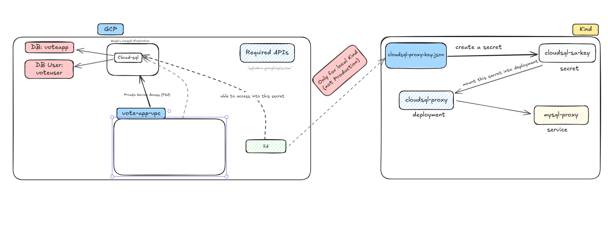

# 🧭 Using Google Cloud SQL (MySQL) with Local Kind Cluster via Cloud SQL Auth Proxy

This guide explains how to integrate **Google Cloud SQL (MySQL)** with a **local Kind Kubernetes cluster** using the **Cloud SQL Auth Proxy**.
It enables your local applications to connect securely to a **private Cloud SQL instance**—mirroring a production-ready setup before moving to **GKE**.

---

## 🧩 1. Architecture Overview (Cloud SQL → Kind via Proxy)



### Actors & Flow

| Component                                           | Description                                                                                         |
| --------------------------------------------------- | --------------------------------------------------------------------------------------------------- |
| **Cloud SQL (MySQL)**                               | Managed database instance in GCP using private IP.                                                  |
| **Database (`voteapp`)**                            | Logical schema inside Cloud SQL for your app.                                                       |
| **DB User (`voteuser`)**                            | App-level MySQL user created for connection.                                                        |
| **VPC (`vote-app-vpc`)**                            | Private network that connects Cloud SQL to other GCP services via **PSA** (Private Service Access). |
| **Service Account (SA)**                            | Identity with `roles/cloudsql.client` to access Cloud SQL securely.                                 |
| **Service Account Key (`cloudsql-proxy-key.json`)** | Used **only in local Kind**, not in production (replaced by Workload Identity in GKE).              |
| **Cloud SQL Auth Proxy**                            | Securely connects to Cloud SQL using IAM credentials.                                               |
| **Kubernetes Secret (`cloudsql-sa-key`)**           | Stores the service account key for proxy authentication.                                            |
| **Kubernetes Service (`mysql-proxy`)**              | Exposes the proxy as a stable endpoint inside Kind (`mysql-proxy:3306`).                            |
| **Application Pods**                                | Connect to MySQL via the proxy endpoint.                                                            |

---

## ⚙️ 2. Prerequisites

Before starting, ensure:

* ✅ You have **gcloud CLI** installed and configured with your GCP project.
* ✅ **Kind cluster** is running locally.
* ✅ **kubectl** and **Helm** are installed.
* ✅ **Cloud SQL Auth Proxy** Docker image is accessible (`gcr.io/cloud-sql-connectors/cloud-sql-proxy`).

---

## 🧱 3. GCP Setup (Console | CLI | Terraform)

You can create Cloud SQL and all related resources using **Console**, **CLI**, or **Terraform**.

---

### 🖥️ A. Console Method

#### **Step 1: Enable Required APIs**

1. Go to **APIs & Services → Library**.
2. Enable:

   * `sqladmin.googleapis.com`
   * `iam.googleapis.com`

---

#### **Step 2: Create a VPC (for Private IP access)**

1. Navigate to **VPC Network → VPC networks**.
2. Create a network named **`vote-app-vpc`**.
3. Under **Private Service Access**, configure **VPC Peering**:

   * Reserve a CIDR range (e.g., `10.50.0.0/24`)
   * Connect to `servicenetworking.googleapis.com`

---

#### **Step 3: Create Cloud SQL Instance**

1. Go to **SQL → Create Instance → MySQL**

2. Configuration:

   * **Name:** `voteapp-sql`
   * **Region:** same as your project region
   * **Database version:** `MySQL 8.0`
   * **Machine type:** `db-custom-1-3840`
   * **Connectivity:**

     * Disable **Public IP**
     * Enable **Private IP**
     * Select **vote-app-vpc**

3. Set **root password** and click **Create Instance**.

---

#### **Step 4: Create Database and User**

After the instance is created:

* Go to the instance details → **Databases** → **Create Database**

  * Name: `voteapp`
* Go to **Users** → **Create User**

  * Name: `voteuser`
  * Password: `rootpass`

---

#### **Step 5: Create Service Account for Proxy**

1. Navigate to **IAM & Admin → Service Accounts** → **Create Service Account**

   * Name: `cloudsql-proxy`
2. Assign role:

   * `roles/cloudsql.client`
3. Go to **Keys → Add Key → Create new key**

   * Choose **JSON** format.
   * Save the file as **`cloudsql-proxy-key.json`** (keep it secure).

---

### 💻 B. CLI Method

Execute the following (or use your `install-cloudsql.sh`):

```bash
# Configuration
export PROJECT_ID="your-project-id"
export LAB_REGION="us-west1"
export LAB_ZONE="us-west1-c"
export DB_INSTANCE_NAME="voteapp-sql"
export DB_NAME="voteapp"
export DB_USER="voteuser"
export DB_PASS="rootpass"
export DB_ROOT_PASS="rootpass"

# Enable APIs
gcloud services enable sqladmin.googleapis.com iam.googleapis.com

# Create MySQL Instance (Private IP)
gcloud sql instances create $DB_INSTANCE_NAME \
  --database-version=MYSQL_8_0 \
  --tier=db-custom-1-3840 \
  --region=$LAB_REGION \
  --root-password=$DB_ROOT_PASS

# Create Database
gcloud sql databases create $DB_NAME --instance=$DB_INSTANCE_NAME

# Create App User
gcloud sql users create $DB_USER --instance=$DB_INSTANCE_NAME --password=$DB_PASS

# Create Service Account
gcloud iam service-accounts create cloudsql-proxy \
  --display-name="Cloud SQL Proxy for Vote App"

# Grant Permission
gcloud projects add-iam-policy-binding $PROJECT_ID \
  --member="serviceAccount:cloudsql-proxy@$PROJECT_ID.iam.gserviceaccount.com" \
  --role="roles/cloudsql.client"

# Generate Key
gcloud iam service-accounts keys create cloudsql-proxy-key.json \
  --iam-account=cloudsql-proxy@$PROJECT_ID.iam.gserviceaccount.com
```

---

### ⚙️ C. Terraform Method

**Project Structure:**

```
.
├── main.tf
├── modules
│   ├── network
│   │   ├── main.tf
│   │   └── outputs.tf
│   ├── cloud_sql
│   │   ├── main.tf
│   │   └── variables.tf
│   ├── iam
│   │   ├── main.tf
│   │   └── outputs.tf
├── provider.tf
├── outputs.tf
└── terraform.tfvars
```

#### **Terraform Cloud SQL Module**

```hcl
resource "google_sql_database_instance" "mysql_instance" {
  project          = var.project_id
  name             = var.db_instance_name
  region           = var.region
  database_version = "MYSQL_8_0"

  settings {
    tier = var.db_tier

    ip_configuration {
      ipv4_enabled    = false                     # ✅ Private IP only
      private_network = var.network_self_link     # Connect to VPC via PSA
    }

    activation_policy = "ALWAYS"
  }
}

resource "google_sql_database" "database" {
  name     = var.db_name
  instance = google_sql_database_instance.mysql_instance.name
  project  = var.project_id
}

resource "google_sql_user" "app_user" {
  name     = var.db_user
  instance = google_sql_database_instance.mysql_instance.name
  project  = var.project_id
  password = var.db_pass
}
```

After configuration:

```bash
terraform init
terraform apply -auto-approve
```

Outputs:

```
Apply complete! Resources: 10 added, 0 changed, 0 destroyed.

Outputs:
instance_connection_name = "project:region:voteapp-sql"
```

---

## ☸️ 4. Kind Cluster Integration (Cloud SQL Proxy Setup)

### **Step 1: Create Kubernetes Secret**

Add your service account key into the Kind cluster:

```bash
kubectl create secret generic cloudsql-sa-key \
  --from-file=key.json=cloudsql-proxy-key.json \
  -n vote-app
```

---

### **Step 2: Apply Cloud SQL Proxy Deployment**

Use your `cloudsql-proxy.yaml`:

```yaml
apiVersion: apps/v1
kind: Deployment
metadata:
  name: cloudsql-proxy
  namespace: vote-app
spec:
  replicas: 1
  selector:
    matchLabels:
      app: cloudsql-proxy
  template:
    metadata:
      labels:
        app: cloudsql-proxy
    spec:
      containers:
      - name: cloudsql-proxy
        image: gcr.io/cloud-sql-connectors/cloud-sql-proxy:2.11.4
        args:
          - "--address=0.0.0.0"
          - "--port=3306"
          - "--credentials-file=/secrets/key.json"
          - "${PROJECT_ID}:${LAB_REGION}:${DB_INSTANCE_NAME}"
        volumeMounts:
        - name: sa-key
          mountPath: /secrets
          readOnly: true
        ports:
        - containerPort: 3306
      volumes:
      - name: sa-key
        secret:
          secretName: cloudsql-sa-key
---
apiVersion: v1
kind: Service
metadata:
  name: mysql-proxy
  namespace: vote-app
spec:
  selector:
    app: cloudsql-proxy
  ports:
    - name: mysql
      port: 3306
      targetPort: 3306
```

Apply:

```bash
kubectl apply -f cloudsql-proxy.yaml
```

---

### **Step 3: Test the Connection**

Run a MySQL client pod and verify connectivity:

```bash
kubectl run sql-client --rm -it --image=mysql:8 --namespace=vote-app -- bash
mysql -h mysql-proxy -P 3306 -u$DB_USER -p$DB_PASS $DB_NAME -e 'SELECT VERSION();'
```

Expected Output:

```
+-----------+
| VERSION() |
+-----------+
| 8.0.36    |
+-----------+
```

---

## 🔍 5. Validation

```bash
# Verify Proxy Pod
kubectl get pods -n vote-app

# Check Logs
kubectl logs -n vote-app deploy/cloudsql-proxy

# Confirm Service
kubectl get svc -n vote-app mysql-proxy

# Describe Secret
kubectl describe secret -n vote-app cloudsql-sa-key
```

---

## 🚧 6. Migration Note (For GKE)

When moving to **GKE**, replace JSON key authentication with **Workload Identity**:

* No local key files (`cloudsql-proxy-key.json`)
* Bind GKE service account to Cloud SQL IAM identity
* Use same proxy configuration, but without `--credentials-file`

---

## ✅ 7. Summary

| Layer                              | Component         | Purpose                             |
| ---------------------------------- | ----------------- | ----------------------------------- |
| **Cloud SQL (MySQL)**              | Managed DB        | Persistent storage backend          |
| **VPC (vote-app-vpc)**             | Network isolation | Enables private IP connection       |
| **Private Service Access**         | Connectivity      | Bridges managed services to VPC     |
| **Service Account**                | Authentication    | Identity for proxy                  |
| **Cloud SQL Proxy**                | Secure connection | Authenticates & tunnels SQL traffic |
| **K8s Secret (`cloudsql-sa-key`)** | Credential store  | Used by proxy pod                   |
| **Service (`mysql-proxy`)**        | Access endpoint   | Provides stable MySQL endpoint      |
| **Application Pod**                | Consumer          | Connects via proxy to Cloud SQL     |

---


> 🧾 **Note:**
>
> * For local Kind only → use JSON key authentication.
> * For production GKE → switch to **Workload Identity** (no static key).
> * Always use **private IP** via PSA to keep data secure.
---

