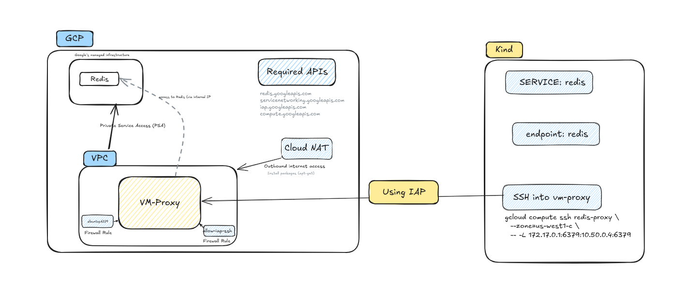

# 🧭 Using Google Cloud Memorystore (Redis) with Local Kind Cluster via Proxy VM

This document explains how to set up and connect **Google Cloud Memorystore (Redis)** to a **local Kind Kubernetes cluster** using a **VM proxy and IAP tunnel**.  
It enables local workloads to securely communicate with a private Redis instance over a production-like network configuration.

---

## 🧩 1. Architecture Overview (Kind → Redis via IAP)



### Components

| Component | Description |
| ---------- | ------------ |
| **Redis (GCP Memorystore)** | Managed Redis instance, accessible only via Private Service Access (PSA). |
| **VPC Network** | Provides private networking and internal IPs for Redis and VM. |
| **VM Proxy** | Secure compute instance used to bridge local and private Redis traffic. |
| **Cloud NAT + Router** | Enables outbound internet access from the proxy VM without public IP. |
| **Firewall Rules** | Allow IAP SSH (port 22) and Redis access (port 6379). |
| **IAP (Identity-Aware Proxy)** | Used to securely SSH into the proxy VM from local. |
| **Kind Cluster** | Runs locally and communicates with Redis through the VM proxy tunnel. |

---

## ⚙️ 2. Prerequisites

Before starting, ensure:

- ✅ **gcloud CLI** is installed and authenticated (`gcloud auth login`)
- ✅ **Kind** cluster is up and running locally
- ✅ **kubectl** and **Helm** are installed
- ✅ You have IAM permissions to create Redis, Compute, and VPC resources
- ✅ The following environment variables are set:

  ```bash
  export PROJECT_ID="your-gcp-project-id"
  export LAB_REGION="us-west1"
  export LAB_ZONE="us-west1-c"

## 🧱 3. Provision Redis Infrastructure (Console | CLI | Terraform)

This section explains how to create and configure:

* A **VPC network**
* **Private Service Access (PSA)**
* **Redis instance**
* **Proxy VM**
* **Cloud NAT**
* **Firewall rules**

---

### 🖥️ A. Console Method

#### 1. Enable Required APIs

Go to **APIs & Services → Library**, then enable:

* `Compute Engine API`
* `Redis API`
* `Service Networking API`
* `IAP API`

---

#### 2. Create a VPC Network

1. Navigate to **VPC Network → VPC Networks → Create VPC network**
2. Name it: `vote-app-vpc`
3. Choose **Custom** mode and **create one subnet** (e.g., `vote-app-subnet` in your region)
4. Enable **Private Google Access**

---

#### 3. Configure Private Service Access (PSA)

1. Go to **VPC Network → Private Service Connections**
2. Click **Set up connection**

   * Select your VPC (`vote-app-vpc`)
   * Reserve an internal IP range: `10.50.0.0/20`
   * Choose **Service Networking (servicenetworking.googleapis.com)**
3. Click **Create Connection**

---

#### 4. Create a Redis Instance

1. Go to **Memory Store → Redis → Create Instance**
2. Choose:

   * **Tier:** `STANDARD`
   * **Region:** `${LAB_REGION}`
   * **Network:** `vote-app-vpc`
   * **Connection type:** `Private Service Access`
   * **Size:** `1 GB`
3. Click **Create**

---

#### 5. Create Proxy VM (No Public IP)

1. Go to **Compute Engine → VM Instances → Create Instance**
2. Name: `redis-proxy`
3. Zone: `${LAB_ZONE}`
4. Machine Type: `e2-micro`
5. Networking:

   * Network: `vote-app-vpc`
   * **No external IP**
6. Create the instance.

---

#### 6. Configure Cloud Router + NAT

1. Go to **Hybrid Connectivity → Cloud Routers**

   * Name: `default-router`
   * Region: `${LAB_REGION}`
   * Network: `vote-app-vpc`
2. Go to **Hybrid Connectivity → Cloud NAT**

   * Name: `default-nat`
   * Attach to `default-router`
   * Set **Auto-allocate external IPs**
   * Apply to **All subnets**

---

#### 7. Create Firewall Rules

Create two rules:

* **allow-iap-ssh** → allows SSH from IAP to the VM (port `22`)
* **allow-redis-6379** → allows TCP `6379` inbound to the VM from anywhere in the network

---

#### 8. Install Redis Tools on VM

SSH into VM using IAP:

```bash
gcloud compute ssh redis-proxy --zone=${LAB_ZONE}
```

Then inside VM:

```bash
sudo apt-get update -y && sudo apt-get install -y redis-tools
```

---

### 💻 B. CLI Method

Follow these steps in your terminal:

#### 1. Set Project and Region

```bash
gcloud config set project $PROJECT_ID
gcloud config set compute/region $LAB_REGION
gcloud config set compute/zone $LAB_ZONE
```

#### 2. Enable Required APIs

```bash
gcloud services enable \
  compute.googleapis.com \
  redis.googleapis.com \
  servicenetworking.googleapis.com \
  iap.googleapis.com
```

#### 3. Create VPC and Subnet

```bash
gcloud compute networks create vote-app-vpc --subnet-mode=custom

gcloud compute networks subnets create vote-app-subnet \
  --network=vote-app-vpc \
  --region=$LAB_REGION \
  --range=10.0.0.0/24
```

#### 4. Configure Private Service Access (PSA)

Reserve internal IP and connect:

```bash
gcloud compute addresses create google-managed-services-range \
  --global \
  --purpose=VPC_PEERING \
  --addresses=10.50.0.0 \
  --prefix-length=20 \
  --network=vote-app-vpc

gcloud services vpc-peerings connect \
  --service=servicenetworking.googleapis.com \
  --ranges=google-managed-services-range \
  --network=vote-app-vpc
```

#### 5. Create Redis Instance

```bash
gcloud redis instances create my-redis \
  --size=1 \
  --region=$LAB_REGION \
  --tier=STANDARD \
  --network=vote-app-vpc \
  --connect-mode=PRIVATE_SERVICE_ACCESS
```

#### 6. Create Proxy VM (No Public IP)

```bash
gcloud compute instances create redis-proxy \
  --zone=$LAB_ZONE \
  --machine-type=e2-micro \
  --network=vote-app-vpc \
  --no-address \
  --tags=redis-proxy \
  --image-family=debian-12 \
  --image-project=debian-cloud
```

#### 7. Set Up Cloud Router and NAT

```bash
gcloud compute routers create default-router \
  --network=vote-app-vpc \
  --region=$LAB_REGION

gcloud compute routers nats create default-nat \
  --router=default-router \
  --region=$LAB_REGION \
  --auto-allocate-nat-external-ips \
  --nat-all-subnet-ip-ranges
```

#### 8. Create Firewall Rules

```bash
gcloud compute firewall-rules create allow-redis-6379 \
  --network=vote-app-vpc \
  --allow=tcp:6379 \
  --target-tags=redis-proxy

gcloud compute firewall-rules create allow-iap-ssh \
  --network=vote-app-vpc \
  --allow=tcp:22 \
  --source-ranges=35.235.240.0/20
```

#### 9. Install Redis Tools on VM

```bash
gcloud compute ssh redis-proxy --zone=$LAB_ZONE --command \
"sudo apt-get update -y && sudo apt-get install -y redis-tools"
```

---

### ⚙️ C. Terraform Method

Use the following structure for your modules:

```bash
.
├── main.tf
├── modules
│   ├── api
│   │   └── main.tf
│   ├── network
│   │   ├── main.tf
│   │   └── outputs.tf
│   ├── redis
│   │   ├── main.tf
│   │   └── variables.tf
│   └── vm
│       ├── main.tf
│       └── variables.tf
├── outputs.tf
├── provider.tf
├── terraform.tfvars
└── variables.tf
```

#### Example Terraform Resources

```hcl
# Create VPC
resource "google_compute_network" "vpc" {
  name = "vote-app-vpc"
}

# Private Service Access (PSA)
resource "google_compute_global_address" "google_managed_services_range" {
  name          = "google-managed-services-range"
  purpose       = "VPC_PEERING"
  address_type  = "INTERNAL"
  prefix_length = 20
  address       = "10.50.0.0"
  network       = google_compute_network.vpc.id
}

resource "google_service_networking_connection" "private_vpc_connection" {
  network                 = google_compute_network.vpc.id
  service                 = "servicenetworking.googleapis.com"
  reserved_peering_ranges = [google_compute_global_address.google_managed_services_range.name]
}
```

Then define Redis, VM, Router, NAT, and firewall rules in their respective modules.

Apply the configuration:

```bash
terraform init
terraform apply -auto-approve
```

✅ Output example:

```
Apply complete! Resources: 10 added, 0 changed, 0 destroyed.
redis_private_ip = 10.50.0.4
proxy_vm_name = redis-proxy
```

---

## 🚀 4. Connect Kind Cluster to Redis

Once Redis and the VM proxy are deployed, use the following setup to connect from Kind.

### A. Create Service and Endpoints

```yaml
# redis-svc.yaml
apiVersion: v1
kind: Service
metadata:
  name: redis
  namespace: vote-app
spec:
  ports:
    - protocol: TCP
      port: 6379
      targetPort: 6379
  type: ClusterIP
```

```yaml
# redis-endpoints.yaml
apiVersion: v1
kind: Endpoints
metadata:
  name: redis
  namespace: vote-app
subsets:
  - addresses:
      - ip: 172.17.0.1
    ports:
      - port: 6379
```

Apply them:

```bash
kubectl apply -f redis-svc.yaml
kubectl apply -f redis-endpoints.yaml
```

---

### B. Establish SSH Tunnel via IAP

```bash
gcloud compute ssh redis-proxy \
  --zone=us-west1-c \
  -- -L 172.17.0.1:6379:10.50.0.4:6379
```

This forwards:

* Local Kind IP (`172.17.0.1:6379`)
* To Redis private IP (`10.50.0.4:6379`) inside GCP.

---

### C. Validate Connection

Inside your Kind cluster:

```bash
kubectl exec -it <pod-name> -- redis-cli -h redis -p 6379 ping
```

Expected output:

```
PONG
```

---

## 🚧 5. Migration Note (For GKE)

When moving to **Google Kubernetes Engine (GKE)**:

* Use **VPC-native** clusters for direct Redis access (no tunnel needed)
* Remove manual `Endpoints` setup
* Use **Private Google Access** and **Service Connect**
* Apply **least-privilege IAM** for Redis and Compute roles

---

## ✅ 6. Summary

| Layer                       | Component       | Purpose                        |
| --------------------------- | --------------- | ------------------------------ |
| **Redis (GCP Memorystore)** | Managed Redis   | Secure, private, managed cache |
| **VPC + PSA**               | Network         | Enables private connectivity   |
| **VM Proxy**                | Bridge          | Provides secure access via IAP |
| **Cloud NAT**               | Outbound access | Allows updates, installs       |
| **Firewall Rules**          | Access control  | SSH and Redis ports            |
| **Kind Service/Endpoints**  | Local bridge    | Exposes Redis inside Kind      |
| **IAP Tunnel**              | Secure channel  | Connects local Kind → Redis    |

---

> 💡 **Tip:**
> This architecture mimics production-grade Redis networking, ensuring your **local Kind environment** behaves exactly like **GKE in private mode**.
