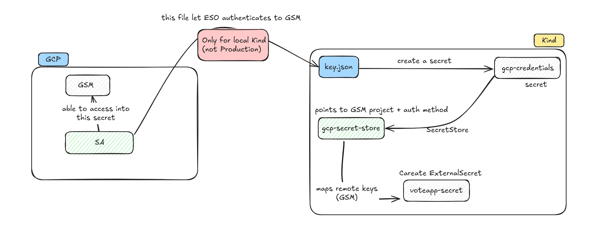

# 🧭 Using Google Secret Manager (GSM) on Local Kind Cluster

This guide explains how to integrate **Google Secret Manager (GSM)** with a **local Kind Kubernetes cluster** using the **External Secrets Operator (ESO)**.  
It replicates a production-grade secret management workflow locally before migrating to **Google Kubernetes Engine (GKE)**.

---

## 🧩 1. Architecture Overview (Kind → GSM via ESO)



### Actors & Flow

| Component | Description |
| --- | --- |
| **GSM (Google Secret Manager)** | Source of truth for all secrets (e.g., `MYSQL_USER`, `MYSQL_PASSWORD`, `MYSQL_ROOT_PASSWORD`). |
| **GCP Service Account (SA)** | Granted `Secret Manager Secret Accessor` to read required secrets. |
| **SA Key (JSON)** | Used **only for local development** (Kind) to authenticate ESO to GSM. |
| **Kubernetes Secret (`gcp-credentials`)** | Stores the key JSON for ESO to use. |
| **External Secrets Operator (ESO)** | Syncs secrets from GSM into Kubernetes. |
| **SecretStore** | Defines the GSM connection and authentication method. |
| **ExternalSecret** | Maps which secrets to fetch and how to expose them locally. |
| **Application Pods** | Consume the synced Kubernetes Secrets as environment variables or mounted volumes. |

---

## ⚙️ 2. Prerequisites

Ensure the following before continuing:

- ✅ **gcloud CLI** configured with access to your GCP project  
- ✅ **Kind cluster** is up and running  
- ✅ **Helm** and **kubectl** installed  
- ✅ **External Secrets Operator (ESO)** installed (see step 4)

---

## 🧱 3. GSM & Service Account Setup (Console | CLI | Terraform)

This step covers creating GSM secrets, a service account, and the authentication key.  
You can perform these actions via **Console**, **CLI**, or **Terraform**.

---

### 🖥️ A. Console Method

1. **Enable Secret Manager API**  
   - Go to **Security → Secret Manager** in the GCP Console  
   - Enable the **Secret Manager API**

2. **Create Secrets**
   - Create the following:
     - `mysql-root-password`
     - `mysql-password`
     - `mysql-user`

3. **Create Service Account**
   - Navigate to **IAM → Service Accounts → Create Service Account**
   - Name: `eso-sa`
   - Assign Role: **Secret Manager Secret Accessor**

4. **Generate and Download Key**
   - Open the created service account (`eso-sa`)
   - Click the **⋮** menu → **Manage Keys**
   - Create new key → choose **JSON**
   - Save the file locally as `key.json`  
     ⚠️ **Do not commit this file** to version control

---

### 💻 B. CLI Method

```bash
# Authenticate & set project
gcloud auth login
export PROJECT_ID="your_project_id"
gcloud config set project $PROJECT_ID

# Enable the Secret Manager API
gcloud services enable secretmanager.googleapis.com

# Create Secrets in GSM
echo -n "rootpass" | gcloud secrets create mysql-password --data-file=-
echo -n "rootpass" | gcloud secrets create mysql-root-password --data-file=-
echo -n "voteuser" | gcloud secrets create mysql-user --data-file=-

# Create Service Account for ESO
gcloud iam service-accounts create eso-sa --display-name="ESO Service Account"

# Grant Secret Accessor Role
gcloud projects add-iam-policy-binding $PROJECT_ID \
  --member="serviceAccount:eso-sa@$PROJECT_ID.iam.gserviceaccount.com" \
  --role="roles/secretmanager.secretAccessor"

# Generate Key for Local Authentication
gcloud iam service-accounts keys create key.json \
  --iam-account=eso-sa@$PROJECT_ID.iam.gserviceaccount.com
````

---

### ⚙️ C. Terraform Method

If using Infrastructure as Code, structure your Terraform modules as below:

```bash
.
├── main.tf
├── modules
│   ├── api
│   │   └── main.tf
│   ├── iam
│   │   ├── main.tf
│   │   ├── outputs.tf
│   │   └── variables.tf
│   └── secretmanager
│       ├── main.tf
│       └── variables.tf
├── outputs.tf
├── provider.tf
├── terraform.tfvars
└── variables.tf
```

After applying Terraform:

```bash
terraform apply -auto-approve
```

You should see:

```
Apply complete! Resources: 10 added, 0 changed, 0 destroyed.

Outputs:
eso_key = <sensitive>
```

---

## 🚀 4. Install External Secrets Operator (ESO)

Check if ESO is installed; if not, install it using Helm:

```bash
if ! helm status external-secrets -n "$K8S_NAMESPACE" >/dev/null 2>&1; then
  helm repo add external-secrets https://charts.external-secrets.io
  helm repo update
  helm install external-secrets external-secrets/external-secrets -n "$K8S_NAMESPACE"
else
  echo "ℹ️ ESO already installed, skipping Helm install."
fi
```

---

## 🔐 5. Create Kubernetes Secret for GCP Credentials

Add your local `key.json` file to Kubernetes:

```bash
kubectl create secret generic gcp-credentials \
  --from-file=credentials.json=key.json
```

---

## 🧩 6. Configure SecretStore

Define GSM connection and authentication method:

```yaml
apiVersion: external-secrets.io/v1
kind: SecretStore
metadata:
  name: gcp-secret-store
spec:
  provider:
    gcpsm:
      projectID: "${PROJECT_ID}"
      auth:
        secretRef:
          secretAccessKeySecretRef:
            name: gcp-credentials
            key: credentials.json
```

Apply it:

```bash
envsubst < gcp-secret-store.yaml | kubectl apply -f -
```

---

## 🧱 7. Configure ExternalSecret

Sync GSM secrets into Kubernetes Secrets:

```yaml
apiVersion: external-secrets.io/v1
kind: ExternalSecret
metadata:
  name: voteapp-secret
spec:
  refreshInterval: 1m
  secretStoreRef:
    name: gcp-secret-store
    kind: SecretStore
  target:
    name: voteapp-secret
    creationPolicy: Owner
  data:
    - secretKey: MYSQL_PASSWORD
      remoteRef:
        key: mysql-password
    - secretKey: MYSQL_ROOT_PASSWORD
      remoteRef:
        key: mysql-root-password
    - secretKey: MYSQL_USER
      remoteRef:
        key: mysql-user
```

Apply:

```bash
kubectl apply -f mysql-credentials.yaml
```

---

## 🔍 8. Validation

```bash
# Check ESO Pods
kubectl get pods -n external-secrets

# Inspect SecretStore & ExternalSecret
kubectl describe secretstore gcp-secret-store
kubectl describe externalsecret voteapp-secret

# Verify the Synced Secret
kubectl get secret voteapp-secret -o yaml

# If any issues arise
kubectl logs -l app.kubernetes.io/name=external-secrets -n external-secrets
```

---

## 🚧 9. Migration Note (For GKE)

When moving to **GKE**:

* Replace key-based auth with **Workload Identity** (no JSON file).
* Use **ClusterSecretStore** if multiple namespaces need access.
* Consider **Secret Manager CSI Driver** for direct mount (no K8s Secret).
* Follow **least-privilege IAM**.

---

## ✅ 10. Summary

| Layer                              | Component        | Purpose                          |
| ---------------------------------- | ---------------- | -------------------------------- |
| **GSM**                            | Secret storage   | Central, versioned, secure       |
| **Service Account**                | Authentication   | Controlled IAM access            |
| **SA Key (Kind only)**             | Local auth       | Temporary for local Kind use     |
| **K8s Secret (`gcp-credentials`)** | Stores key       | Used by ESO                      |
| **SecretStore**                    | Provider config  | Connects to GSM with credentials |
| **ExternalSecret**                 | Mapping          | Syncs GSM → K8s Secret           |
| **App Secret (`voteapp-secret`)**  | Consumed by pods | Provides MySQL credentials       |

---

> 🧾 **Tip:**
> In production, replace key-based authentication with Workload Identity and enforce tight IAM policies.