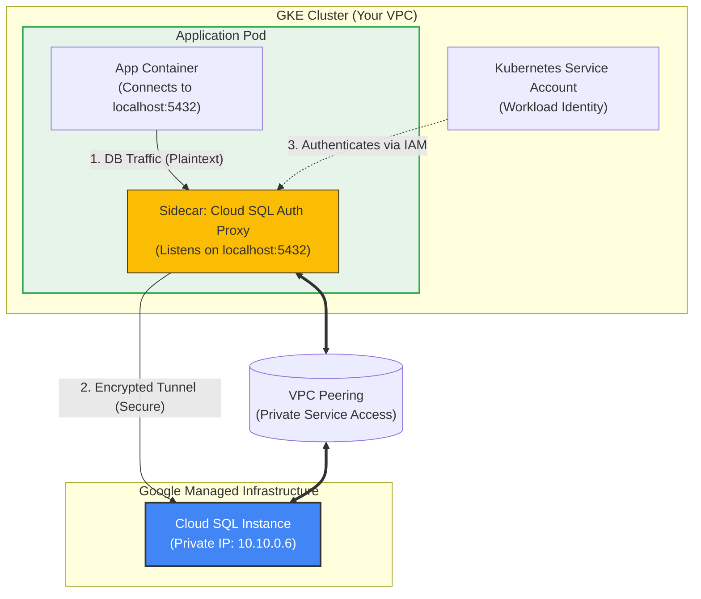

# Cloud SQL (PostgreSQL) on GKE Guide

This guide explains how your GKE application connects to a managed Cloud SQL instance using Google's recommended secure practices.

## 1. Architecture: How it Works

Connecting to Cloud SQL from GKE involves two main security layers:
1.  **Network Layer (Private IP)**: Traffic stays on Google's private network using VPC Peering.
2.  **Identity Layer (Auth Proxy)**: Authentication is handled seamlessly by the Cloud SQL Auth Proxy sidecar, so your app doesn't need to manage SSL certificates manually.

### Visualization



## 2. Key Components

### Private Service Access (PSA)
Just like Redis, Cloud SQL sits in a Google-managed VPC. We peer your VPC with Google's VPC so your pods can reach the database's private IP address.

### Cloud SQL Auth Proxy
This is a small binary that runs as a **sidecar container** in your Pod.
*   **Why use it?**
    *   It handles authentication (using IAM, no need for static IP allowlists).
    *   It automatically encrypts traffic.
    *   It handles connection pooling and failover.
*   **How it works**: Your app connects to `localhost:5432`. The proxy intercepts this, encrypts it, and tunnels it to the Cloud SQL instance.

### Workload Identity
Instead of downloading a Service Account Key (JSON file) and mounting it as a secret (which is insecure), we use **Workload Identity**.
*   We allow the Kubernetes Service Account (KSA) to "act as" a Google Service Account (GSA).
*   The GSA has the `Cloud SQL Client` role.

## 3. Verification Guide

Once implemented, how do we prove it works?

### Prerequisite
You need the **Instance Connection Name** (e.g., `my-project:us-central1:my-instance`).

### Method 1: The "Quick Test" Pod
Create a temporary pod that runs the proxy and a postgres client.

1.  **Create `test-sql.yaml`**:
    ```yaml
    apiVersion: v1
    kind: Pod
    metadata:
      name: cloud-sql-test
      annotations:
        # If using GKE Autopilot or specific setups, KSA annotation might be needed here
    spec:
      serviceAccountName: <YOUR-KSA-NAME> # Important!
      containers:
      - name: pg-client
        image: postgres:15-alpine
        command: ["/bin/sh", "-c"]
        args:
        - |
          echo "Waiting for proxy..."
          sleep 5
          psql "host=127.0.0.1 sslmode=disable user=<DB_USER> dbname=<DB_NAME>"
        env:
        - name: PGPASSWORD
          value: "<DB_PASSWORD>"
      - name: cloud-sql-proxy
        image: gcr.io/cloud-sql-connectors/cloud-sql-proxy:2.1.0
        args:
          # Replace with your actual Instance Connection Name
          - "--private-ip"
          - "<INSTANCE_CONNECTION_NAME>"
        securityContext:
          runAsNonRoot: true
    ```

2.  **Run logic**:
    *   If the connection succeeds, the `psql` command will enter the shell (or you can run a query like `SELECT NOW();`).
    *   Check logs: `kubectl logs cloud-sql-test -c cloud-sql-proxy` to see if the proxy initialized successfully.

### Method 2: Check the Proxy Logs
In your actual application pod:
```bash
kubectl logs <your-pod-name> -c cloud-sql-proxy
```
Look for:
> "Ready for new connections"

---

## 4. Migration Guide: From Standalone Proxy to Sidecar

If you were previously using a standalone `Deployment` for the Cloud SQL Proxy (exposed via a `Service`), here is why and how we are migrating to the **Sidecar Pattern**.

### Comparison

| Feature | Old Approach (Standalone Deployment) | New Approach (Sidecar) |
| :--- | :--- | :--- |
| **Architecture** | One centralized proxy for all pods. | One proxy per application pod (localhost). |
| **Security** | typically used **Service Account Keys** (JSON files) mounted as secrets. ⚠️ **Less Secure** (Key management risks). | Uses **Workload Identity**. The pod creates an authenticated tunnel automatically. ✅ **More Secure** (No keys). |
| **Performance** | Extra network hop (App -> Service -> Proxy Pod -> Cloud SQL). | No extra network hop (App -> Localhost -> Cloud SQL). |
| **Reliability** | If the proxy deployment fails, *all* apps lose DB access. | If a sidecar fails, only that specific pod is affected. |

### How to Migrate

1.  **Delete** your old `cloudsql-proxy` Deployment and Service.
2.  **Delete** the stored `cloudsql-sa-key` secret.
3.  **Update** your application Deployment to include the proxy container as a **sidecar** (see architecture diagram above).
4.  **Update** your application config to connect to `127.0.0.1:5432` instead of `mysql-proxy:3306`.
