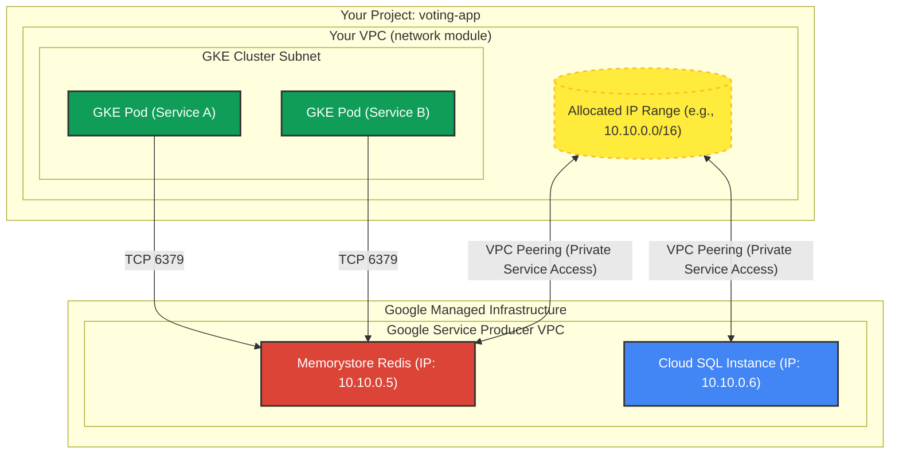

# Redis (Memorystore) Module

This module documents the plan, architecture, and verification steps for implementing Google Cloud Memorystore (Redis) in the GKE environment.

## 1. Redis Implementation Plan

### 1.1 Enable APIs (Project Module)
- [ ] Edit `modules/project/main.tf`
- [ ] Add required APIs to `locals`:
    - `"servicenetworking.googleapis.com"` (for Private Service Access)
    - `"redis.googleapis.com"`

### 1.2 Configure Networking (Network Module)
*Note: This step is shared with Cloud SQL. If already implemented, skip to Step 1.3.*

- [ ] Edit `modules/network/main.tf`
- [ ] Define **Private Service Access** range:
  ```hcl
  resource "google_compute_global_address" "private_ip_alloc" {
    name          = "private-ip-alloc"
    purpose       = "VPC_PEERING"
    address_type  = "INTERNAL"
    prefix_length = 16
    network       = google_compute_network.vpc.id
  }
  ```
- [ ] Create **VPC Peering** connection:
  ```hcl
  resource "google_service_networking_connection" "default" {
    network                 = google_compute_network.vpc.id
    service                 = "servicenetworking.googleapis.com"
    reserved_peering_ranges = [google_compute_global_address.private_ip_alloc.name]
  }
  ```

### 1.3 Create Redis Module
- [ ] Create directory `modules/redis`
- [ ] Create `modules/redis/variables.tf`:
    - `project_id`, `region`, `network_id`, `memory_size_gb`, `tier`
- [ ] Create `modules/redis/main.tf`:
    - Resource `google_redis_instance`:
        - `connect_mode = "PRIVATE_SERVICE_ACCESS"`
        - `authorized_network = var.network_id`
- [ ] Create `modules/redis/outputs.tf`:
    - Output `host` (IP address) and `port`.

### 1.4 Integrated in Root Module
- [ ] Edit root `main.tf`:
    - Instantiate `module "redis"`.
    - Ensure `depends_on = [module.network]` (implicit or explicit) so networking is ready.

### 1.5 Validate
- [ ] Deploy with `terraform apply`.
- [ ] Verify connectivity from GKE pods using `telnet <redis-ip> 6379`.

---

## 2. Architecture & Connectivity Guide

### How GKE Pods Connect to Memorystore (Redis)

To understand how your GKE pods (running in your VPC) connect to Redis (managed by Google), we need to look at **Private Service Access (PSA)**.

#### Key Components

1.  **Your VPC (Customer Network)**: This is where your GKE Cluster resides. It has its own subnets and IP ranges.
2.  **Google's Service VPC (Producer Network)**: Google manages managed services like Memorystore and Cloud SQL in its own completely separate VPCs to ensure isolation and management.
3.  **Allocated IP Range**: You reserve a block of private IPs (e.g., `10.10.0.0/16`) in *your* VPC network that is dedicated for Google services.
4.  **VPC Peering**: This is the "bridge" that connects your VPC to Google's Service VPC. It allows traffic to flow between them as if they were on the same network, using private IPs.

#### The Connection Flow

1.  **Terraform creates the Peering**: When you run the `google_service_networking_connection` code, Google Cloud effectively plugs a network cable between your VPC and their Service VPC.
2.  **Route Exchange**: The peering automatically "imports" routes. Your VPC learns how to reach the allocated range (where Redis lives), and Google's VPC learns how to reach your GKE subnets.
3.  **Redis Provisioning**: When you create the Redis instance, Google picks an IP address from that *Allocated IP Range* you defined.
4.  **Pod Access**: Your GKE Pod simply sends traffic to that private Redis IP (e.g., `10.10.0.5`). The traffic goes through the VPC Peering link and reaches the Redis instance.

#### Visualization



#### Why do we need this?
*   **Security**: Traffic never leaves the Google backbone network. It doesn't travel over the public internet.
*   **Latency**: High-speed internal VPC routing.
*   **Simplicity**: To the pod, it looks like Redis is just another machine on the LAN.

---

## 3. Verification Guide: Connect to Redis from GKE

This guide assumes you have applied your Terraform configuration and your GKE cluster and Cloud Memorystore (Redis) instance are running.

### Step 1: Get the Redis IP Address
First, you need the internal IP address of your Redis instance.
Run this command in your terminal:

```bash
gcloud redis instances list --region=us-central1
```
*(Replace `us-central1` if you used a different region)*.

Note the **HOST** IP address (e.g., `10.123.0.5`).

### Step 2: Deploy a Test Pod
We need a pod inside the cluster that has the `redis-cli` tool. Use the `verify_redis_pod.yaml` file located in this module.

Deploy it to your cluster:
```bash
kubectl apply -f modules/redis/verify_redis_pod.yaml
```

Wait a few seconds for it to start:
```bash
kubectl get pods
# Wait for status 'Running'
```

### Step 3: Connect and Test
Now, "SSH" (exec) into that pod and try to connect to your Redis instance.

1.  **Enter the pod:**
    ```bash
    kubectl exec -it redis-tester -- /bin/bash
    ```

2.  **Connect to Redis:**
    *(Replace `REDIS_IP_ADDRESS` with the IP you found in Step 1)*
    ```bash
    redis-cli -h REDIS_IP_ADDRESS
    ```

3.  **Run a Test Command:**
    If you see a prompt like `10.123.0.5:6379>`, you are connected! Try:
    ```
    ping
    > PONG
    set mykey "Hello From GKE"
    > OK
    get mykey
    > "Hello From GKE"
    ```

### Troubleshooting
If the connection times out:
1.  **Check VPC Peering:** Ensure the "servicenetworking" connection exists in your VPC project.
2.  **Check IP:** Ensure you are using the **HOST** IP, not a public IP (Redis doesn't have one usually).
3.  **Check Region:** Ensure GKE and Redis are in the same region, or verify that your VPC routing allows cross-region traffic (it usually does internal to VPC).
